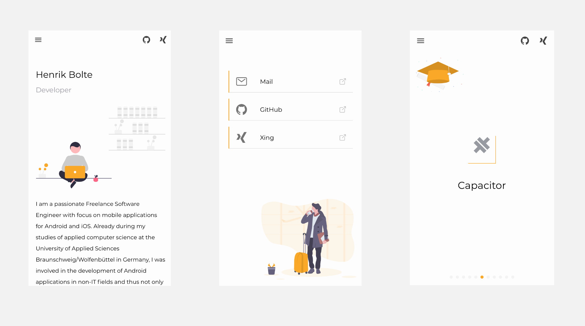

# Ionic-Freelance

## Description

Ionic-Freelance is a lightweight, open-source and easy to use PWA template for freelancer, developer or individual persons who want 
to share their business with the community and potential customers.



## Getting started

### Content
The app uses the CMS-like service of [Contentful](https://contentful.com)  to render content. 
Contentful is a content infrastructure and lets you create, manage and 
distribute content to any platform. Unlike a CMS, Contentful gives you total freedom to 
create your own content model so you can decide which content you want to manage.
They provide you RESTful APIs so you can deliver your content across multiple 
channels such as websites, mobile apps (iOS, Android and Windows Phone) or any 
other platform.

#### Setup
Please create a new account and an empty space. Then go to the settings, copy the `accessToken`
and `spaceId`, and insert the credentials in the predefined keys of the angular environments.

#### Content types
The repository provides a file named `contentful.json`, which can be used to import the current content model
structure to your newly created space. Please have a look at the [documentation](https://www.contentful.com/developers/docs/tutorials/cli/import-and-export/).
Feel free to use the file, but you can also create the models manually in the console.

#### Content
Create the content according to your preferences in the console.

### Firebase
The app uses Firebase for hosting and some analytics events. If you want to use it as well, create
a Firebase project and insert the credentials in the predefined keys of the angular environments.

## Build & run

### Requirements
`npm i -g ionic`

### Install the dependencies
`npm i`

### Run the web-app
`ionic serve`

### Run the native app
```
ionic build
npx cap sync
npx cap open ios/android
```

This will open the native IDE, Android Studio or Xcode.
